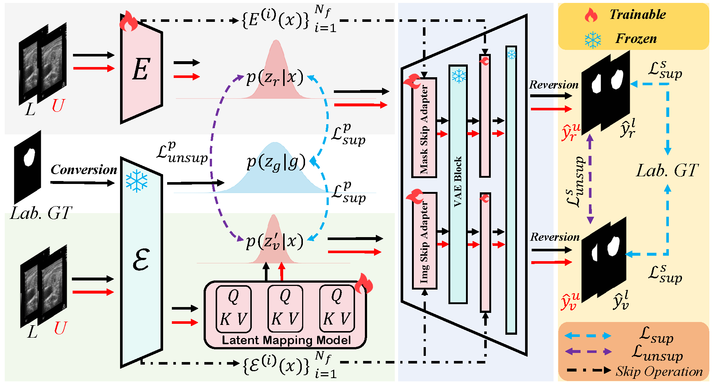

# SemiGDA

Official code for **"SemiGDA: Generative Dual-distribution Alignment for Semi-Supervised Medical Image Segmentation"**


## Overview

SemiGDA is a generative framework for semi-supervised medical image segmentation. It learns structured image-mask representations by aligning latent distributions and leveraging unlabeled data.

The proposed framework consists of a **Dual-distribution Alignment Module (DAM)** for latent feature alignment and a **Consistency-Driven Skip Adapter (CDSA)** for semantic feature fusion, enabling robust segmentation with limited annotations.

<p align="center">

</p>

## Pretrained Models

SemiGDA requires the pretrained Stable Diffusion VAE weights for latent representation extraction.

The pretrained VAE weights can be downloaded from:

[Download VAE Weights](your_download_link)

After downloading, please place the files into the following directory:

```
model/
└── SD-VAE-weights/
    ├── 768-v-ema-first-stage-VAE.ckpt
    └── v2-inference-v-first-stage-VAE.yaml
```
